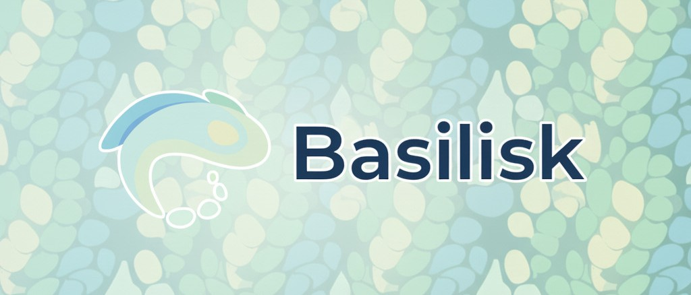

<br/>

A peer-to-peer chat app built on top of libp2p, using TypeScript.

## Building from source

### Requirements

- Node.js (v22 or higher)
- npm

You can get those [here](https://nodejs.org/en/download).

### Instructions

1. Clone the repo:

   ```sh
   git clone https://github.com/msadley/basilisk.git
   ```

2. Install the npm project dependencies:

   ```sh
   npm install
   ```

3. Build the project:

   ```sh
   npm run build
   ```

## Development

### Relay

To set up your own circuit-relay server, create your own pm2 config file at the project's root directory following the example file:

```json
// ecosystem.config.js.example

module.exports = {
  apps: [{
    name: "relay",
    cwd: "./apps/relay",
    script: "./dist/index.js",
    env: {
      PUBLIC_DNS: "your-public-dns"
    }
  }]
}
```

This will ensure the relay server knows where to announce. After that, start the relay server using pm2:

```sh
pm2 start ./ecosystem.config.js
```
